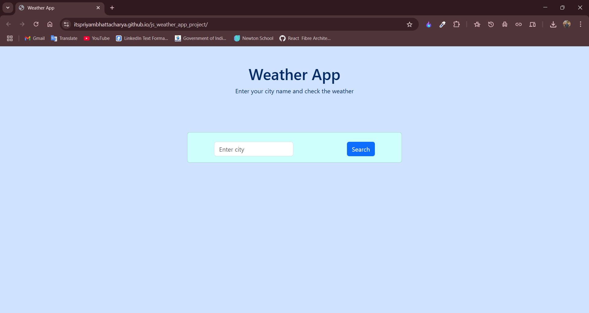
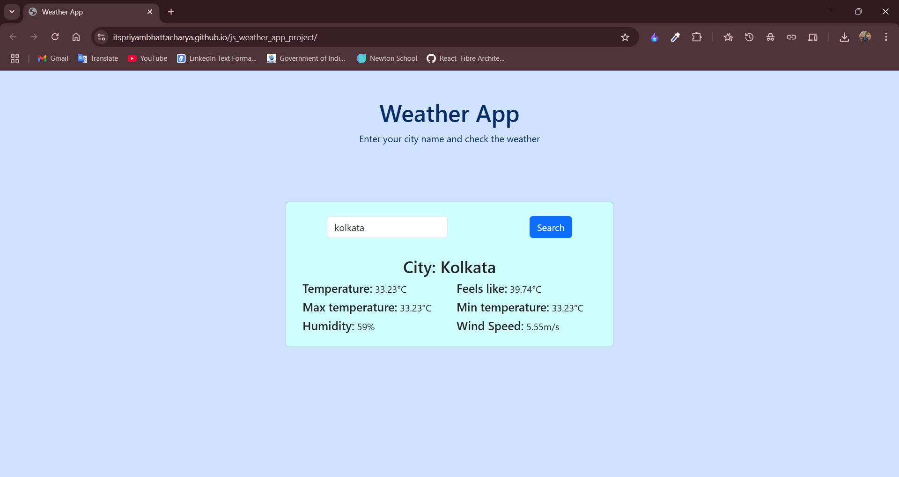

# 🌦️ Weather App

A responsive, user-friendly weather application built using **HTML**, **CSS (Bootstrap 5)**, and **Vanilla JavaScript**. This project integrates with the **OpenWeatherMap API** to provide real-time weather information for any city entered by the user.

---

## 📌 Features

- 🔍 Search current weather by city name
- 🌡️ Displays:
  - Temperature
  - Feels-like temperature
  - Minimum and maximum temperature
  - Humidity
  - Wind speed
- ⚠️ Graceful error handling for invalid city names
- 💡 Responsive card layout powered by Bootstrap
- 🌐 API Integration using `fetch`, `async/await`, and modern ES6+ features

---

## 🛠️ Technologies Used

| Technology         | Purpose                           |
| ------------------ | --------------------------------- |
| HTML5              | Structure of the web application  |
| CSS3 + Bootstrap 5 | Styling and responsive design     |
| JavaScript (ES6+)  | Dynamic behavior, API integration |
| OpenWeatherMap API | Real-time weather data            |

---

## 📂 Project Structure

```
weather-app/
│
├── index.html         # Main interface
├── failed.html        # Redirect page for invalid city names
├── app.js             # Main logic: API call, DOM manipulation
└── README.md          # Project documentation
```

---

## 📷 UI Preview

**Main Interface:**



**Displaying Weather:**



---

## 🧪 How It Works

1. **User Input**  
   User enters a city name and clicks the "Search" button.

2. **API Call**  
   `app.js` makes a call to the OpenWeatherMap API:

   ```js
   const url = `https://api.openweathermap.org/data/2.5/weather?q=${cityVal}&units=metric&appid=<YOUR_API_KEY>`;
   const response = await fetch(url);
   ```

3. **Data Extraction**  
   Weather data is extracted and displayed using DOM manipulation:

   ```js
   tempSpan.innerHTML = data.main.temp;
   flSpan.innerHTML = data.main.feels_like;
   ```

4. **Error Handling**  
   If an invalid city is entered, the user is redirected to `failed.html` with a message and automatic return:

   ```js
   window.location.href = "./failed.html";
   ```

---

## 🧑‍💻 Setup Instructions

1. **Clone the repository**

   ```bash
   git clone https://github.com/itspriyambhattacharya/js_weather_app_project.git
   ```

2. **Open in your browser**
   Simply open `index.html` in a browser.

3. **Add your API key**
   Replace the `appid` value in `app.js`:

   ```js
   const url = `https://api.openweathermap.org/data/2.5/weather?q=${cityVal}&units=metric&appid=YOUR_API_KEY`;
   ```

   > 🔐 You can obtain a free API key from [https://openweathermap.org/api](https://openweathermap.org/api)

---

## 💡 Learning Outcomes

Through this project, you will:

- Understand how to integrate third-party RESTful APIs using `fetch`
- Learn modern JavaScript features like `async/await` and event handling
- Practice Bootstrap grid system and responsive design
- Improve your DOM manipulation skills

---

## 🚀 Future Improvements

- 🌍 Auto-detect user's location for weather display
- 📆 Show 5-day weather forecast using OpenWeatherMap’s forecast API
- 🌙 Toggle between light and dark mode
- 🌐 Multi-language support

---

## 📃 License

This project is licensed under the **MIT License** - feel free to use, modify, and distribute.

---

## 🙋‍♂️ Author

**Priyam Bhattacharya**  
M.Sc. Computer Science, University of Calcutta  
[GitHub](https://github.com/itspriyambhattacharya) | [LinkedIn](https://www.linkedin.com/in/itspriyambhattacharya)

---
